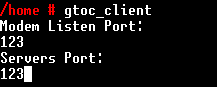
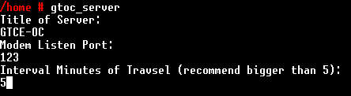
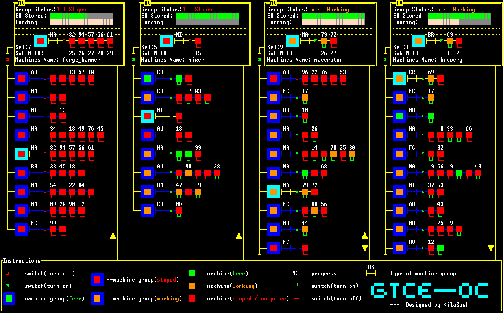
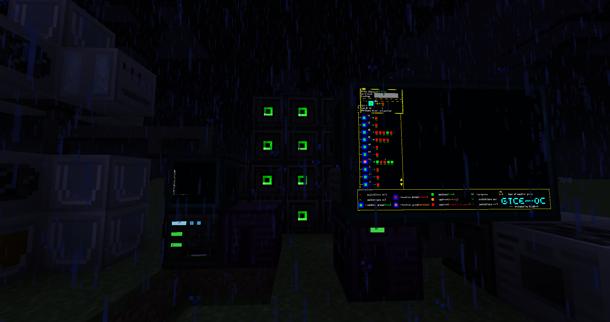

# GTOC
 KilaBash's OpenComputers programs for digitization of gtce.
 A program for GTCE machines monitoring and controling, based on the CS framework.

## Abilities
- Monitor the power, load and running status of the machine.
- Control the running state of the machines by group or type.
#### Additional
- The server and client are many-to-many relationships. A client can display up to four server-managed machines, and a server can connect to any number of clients.
## Download
```shell
pastebin run Eppz6ZzT
```

OR 

```SHELL
wget -f https://raw.githubusercontent.com/Yefancy/GTOC/master/gtoc_installer.lua
./gtoc_installer.lua
```

## Requirements and Run

#### Mods

**gtce2oc-1.7.0 or gregicality-0.21**

#### Client

- Internet Card (only to install)
- Network Card
- Graphics Card T3
- Screen T3

 

#### Server

- Internet Card (only to install)
- Network Card

 

## Screenshots




